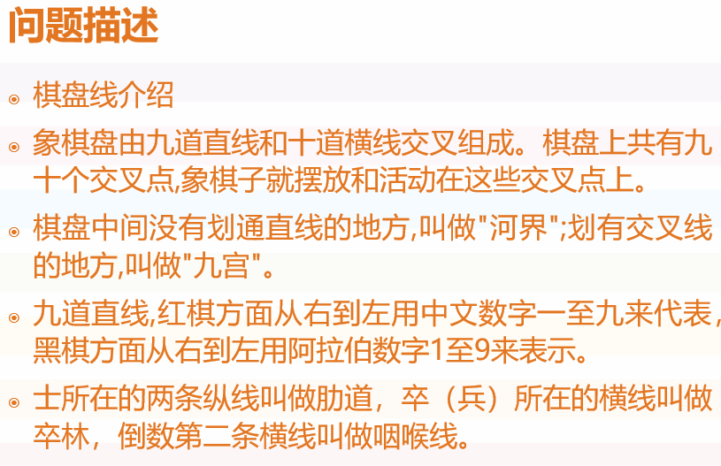
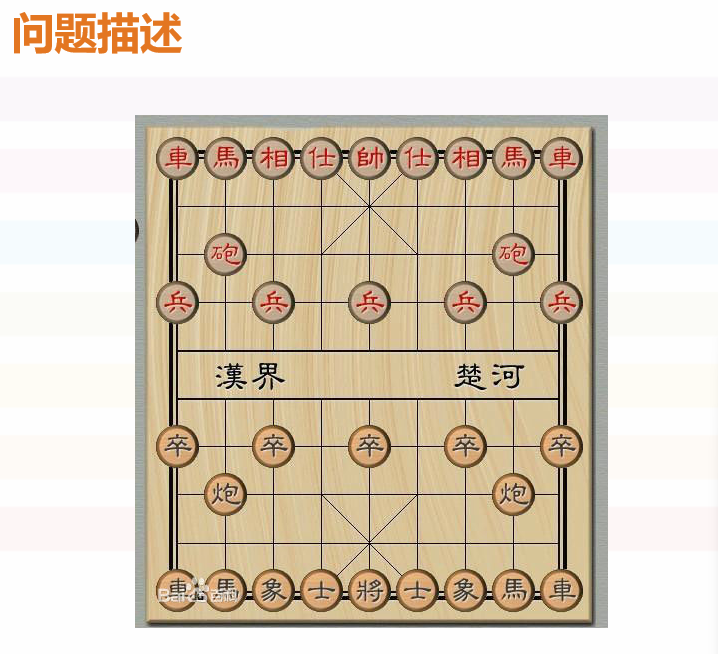
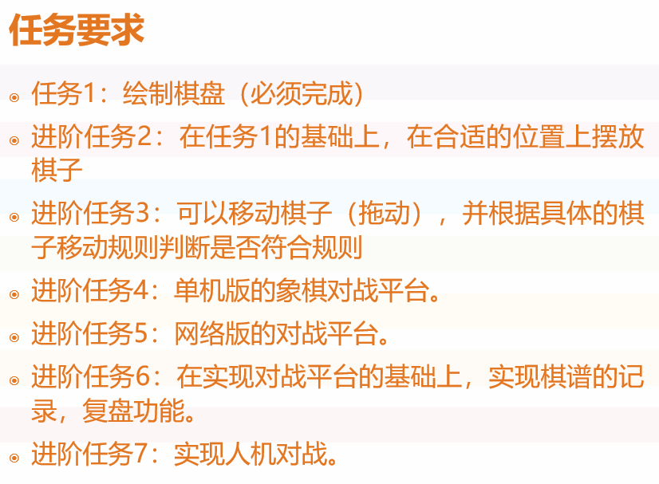

## 说明

本仓库用来存放数据结构与算法课程的课程设计：可视化中国象棋。使用 Qt C++来制作图形化交互，在 Qt Creator 中编写。

使用方法：在 Qt Creator 中点击对应项目的 CmakeLists.txt 即可打开项目。

后来者想学习的话，可以从 commit 记录一点点看我怎么实现的，也可以看我的课程设计报告。我在 `docs` 文件夹有存放自己的课程设计报告，一共四十多页，留给后来人使用。如果对你有帮助只要给我一个小小的 star 就行 :)

代码还是有些 bug 和功能缺失（例如没有棋谱功能以及机器人对战其实非常简陋），如果你对此感兴趣，非常欢迎提出 pull request 和 issue。

## 特点

- 代码包含大量注释说明，且附带文档（课程设计报告）。
- 代码结构简单，基于 has-is 关系。
- 代码进行过多次优化，使其尽可能清晰。
- 支持单机对战、网络对战、人机对战。
- 实现悔棋、复盘功能等，参见 commit 提交记录。
- 支持添加自定义棋子，参见 otheripeces.cpp 。
- 支持自定义棋盘显示大小和位置、组件布局。

## 后记

### 2024-12-20

两个课题算是都完成了（虽然棋盘覆盖有个崩溃 bug 还没修，但我实验报告都写好了，中国象棋的人机是超小白人机），不过还有很多优化的地方，以后就慢慢优化吧（可能 XD）。

本次项目最值得说明的是本项目支持了可视化界面！！！以前写的程序都是用终端处理的，这次算是我第一次接触视化界面，第一次使用 Qt 。这是非常好的经历。在大概半个月前，我安装好 Qt ，在命令行运行出一个简单的程序，然后我的电脑就弹出了一个非常简陋的窗口。虽然简陋，但我的内心还是非常激动的，就像从原始社会步入现代社会一样，上了一年多的大学终于接触到了现代应用的一部分——可视化界面。

这里插句题外话，这次项目其实是算法与数据结构的课程设计，尽管我不知道为啥算法与数据结构为啥突然硬性要求必须使用可视化界面完成，从课程角度来看是非常奇怪的，但不管咋样，就我个人而言这是非常好的，这次的中国象棋也是我第一次觉得写报告有足够的东西写或者说可以自己写一份报告（而不是 ai 编写）的学校课程设计项目。

上手学习的前一周先完成的是棋盘覆盖问题，因为我不太清楚学习的难度。花了大概四天完成了棋盘覆盖，刚好算是给中国象棋练练手了，然后花了 7 天完成了中国象棋的全部要求（大概），搞中国象棋花的时间还是挺多的，截至到今天记录的时间为 50 小时 51 分钟。

对我个人而言，这次的项目具有里程碑意义，一则基本掌握了 Qt 的使用和图形化界面的编写，二则中国象棋项目属于是承前启后了。向上承接我学习的 [C++ Primer Plus](https://github.com/AK47are/CppPrimerPlusExercise)，我将其学到的知识运用到了中国象棋的代码中，比如棋盘类和棋子类的关系，我参考的思想是 C++ Primer Plus 一书中提到的 has-is 关系，电视和遥控器的关系什么的。向后将对我以后的应用设计有很大的帮助。

本来一开始写中国象棋，想着找个视频或则项目参考的写。但当我完成了棋盘覆盖。抱着认真对待的心态作死选择自己从头开始搓，可能是觉得这样可以学到更多东西吧。代码基本全是我自己编写的，当然现在都是 ai 时代了，有不少遇到的问题都是询问 ChatGPT 解决的，ChatGPT 对于个人的学习帮助真的非常大，能弥补很大一部分信息差。尤其是询问 Qt 哪些组件可以实现我想要的功能，一般都是从 ChatGPT 了解到有这个组件，然后要不然查帮助文档，要不然继续问 ChatGPT，理解后把它融入到我的代码中。

### 2025-04-26

后来我果然没有修棋盘覆盖的 bug，今天因为准备在 Github 上添加一个 MC 模组开发的新项目，所以顺手把这个项目整理一下。棋盘覆盖内容可以全删了。

## 课题

  
  
  

